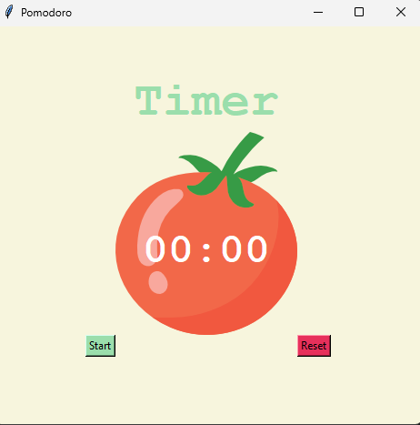
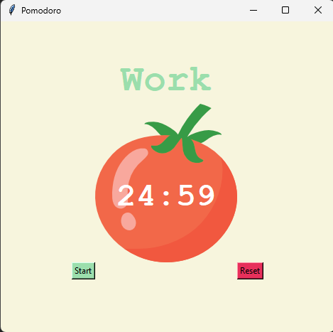

Pomodoro Timer App 
This repository features a Pomodoro Timer, a desktop application developed using Python and its tkinter library. It implements the popular Pomodoro Technique to help users manage their time and enhance focus.

Key Features:

Customizable Timers: Configurable work, short break, and long break durations (default: 25/5/20 minutes).
Intuitive GUI: A clean and easy-to-use interface built with tkinter, including a visual tomato timer.
Session Tracking: Automatically tracks completed work sessions with checkmarks.
Start/Reset Functionality: Buttons to start the timer and reset it at any point.
Visual Cues: (Implied, as it changes text/color) Visual indication of work/break cycles.
A perfect project for practicing GUI development, event handling, and managing application state in Python. Developed as part of the 100 Days of Code Udemy course.

